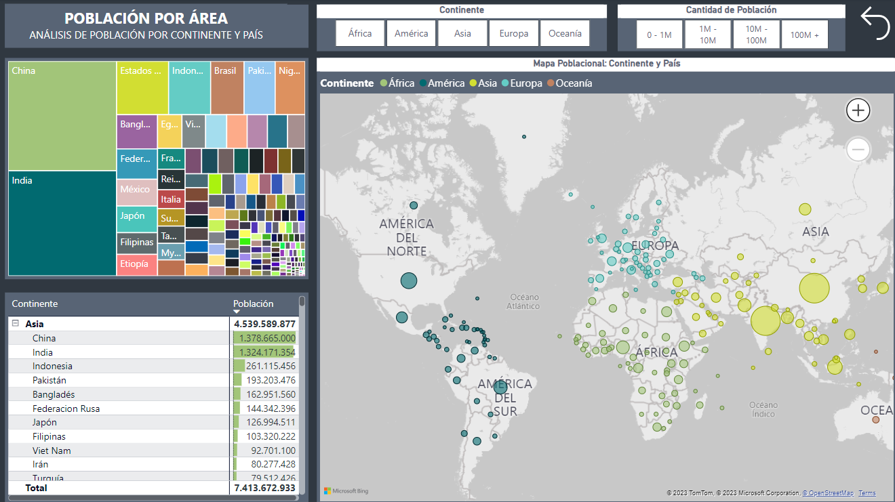
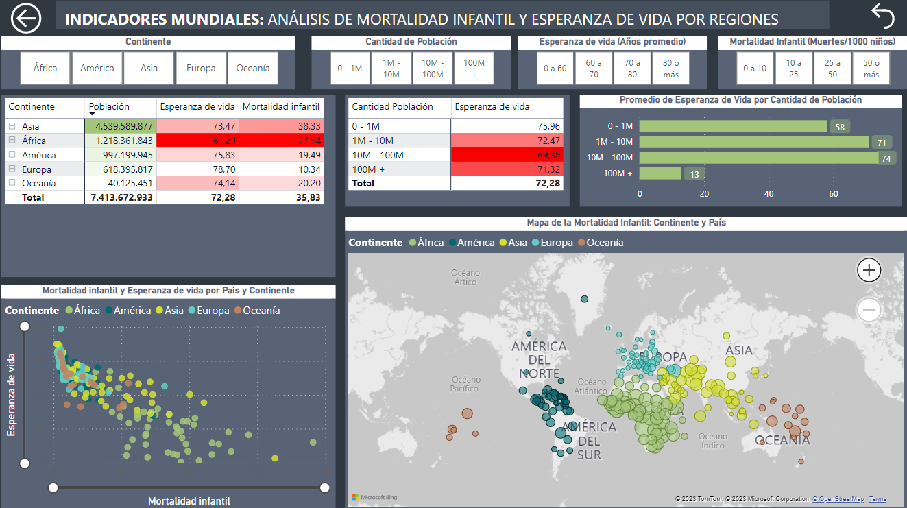

# 🌍 Explorando el Mundo a Través de Datos: Población, Vida y Esperanza en Power BI 📊

#### 👤 Autor: [Alex Marzá Manuel](https://github.com/AlexCapis)

## 📝 Introducción

Este repositorio contiene un proyecto de análisis de datos utilizando la herramienta Power BI. El proyecto se enfoca en el estudio detallado de la población mundial, la mortalidad infantil y la esperanza de vida en diferentes regiones y países del mundo. A través de visualizaciones interactivas y segmentaciones de datos, proporciona una comprensión profunda de estos indicadores clave.

**Descripción General**

El análisis se divide en dos partes principales: `Población por Área` e `Indicadores Mundiales`. 

- **En la primera parte**, nos sumergimos en el análisis de la distribución de la población a nivel de continentes y países. Utilizamos herramientas visuales como treemaps, mapas y matrices para explorar y representar estos datos de manera efectiva.

- **En la segunda parte**, nos adentramos en la comprensión de dos indicadores críticos: la mortalidad infantil y la esperanza de vida. A través de gráficos de dispersión, mapas y matrices, destacamos patrones y tendencias significativas.

  

## 📋Requisitos Previos

Antes de comenzar con este proyecto, es fundamental asegurarse de contar con los siguientes elementos:

- **Power BI**: Este proyecto se desarrolla utilizando Power BI como la herramienta principal para la visualización de datos. Si aún no tienes Power BI instalado en tu sistema, puedes descargar la versión más reciente de Power BI Desktop haciendo clic [aquí](https://powerbi.microsoft.com/es-es/desktop/).

- **Conjuntos de Datos**: Para poder llevar a cabo el análisis y las visualizaciones pertinentes, necesitarás disponer de los siguientes conjuntos de datos disponibles en la carpeta [data](https://github.com/AlexCapis/Indicadores-Mundiales-Mortalidad-Infantil-Esperanza-de-Vida-PowerBI/tree/main/data) del repositorio correspondiente:

    - Countries.xlsx
    - Infant+death+rate.xlsx
    - Life+expectancy.xlsx
    - Paises.xlsx
    - Population.xlsx

## 📂 Estructura de carpetas

Para una fácil navegación, he organizado el repositorio de la siguiente manera:

- [data](https://github.com/AlexCapis/Indicadores-Mundiales-Mortalidad-Infantil-Esperanza-de-Vida-PowerBI/tree/main/data): Contiene los archivos relacionados con los datos utilizados en el proyecto de Power BI.

    - `indicadores_mundiales.pbix`: El archivo de Power BI que contiene el proyecto con las visualizaciones y el análisis.
    - `Countries.xlsx`: El conjunto de datos original en formato Excel que se utiliza en el proyecto que alberga los países y continentes.
    - `Infant+death+rate.xlsx`: El conjunto de datos original en formato Excel que se utiliza en el proyecto que contiene los países y su mortalidad infantil.
    - `Life+expectancy.xlsx`: El conjunto de datos original en formato Excel que se utiliza en el proyecto que plasma los países y su esperanza de vida.
    - `Paises.xlsx`: El conjunto de datos original en formato Excel que se utiliza en el proyecto contiene los países y su continente.
    - `Population.xlsx`: El conjunto de datos original en formato Excel que se utiliza en el proyecto alberga los países y su población.

- [docs](https://github.com/AlexCapis/Indicadores-Mundiales-Mortalidad-Infantil-Esperanza-de-Vida-PowerBI/tree/main/docs/images): Almacena documentos y recursos relacionados con la documentación del proyecto.

    - `images`: Una carpeta que almacena las imágenes y gráficos utilizados en el proyecto.

- [notebooks](https://github.com/AlexCapis/Indicadores-Mundiales-Mortalidad-Infantil-Esperanza-de-Vida-PowerBI/tree/main/notebooks): Contiene archivos de cuadernos Jupyter relacionados con el proyecto de Power BI.

    - `explicacion_indicadores_mundiales.ipynb`: Un cuaderno que incluye una explicación detallada del proyecto.

- `.gitignore`: Un archivo que especifica qué archivos o carpetas deben ser ignorados por Git al realizar seguimiento de cambios.

## 📹 Demostración en Video

Antes de sumergirse en los detalles, echa un vistazo a la demostración en video que te guiará a través de las funcionalidades clave de este proyecto en Power BI. ¡Haz clic en la imagen para ver el video!

## ⚙️ Configuración de los Datos

Primero, realicé transformaciones en el conjunto de datos a través del editor de Power Query para obtener las siguientes columnas: 

- Se carga el archivo de `Population` para crear dos nuevas columnas, una la de la **cantidad de población** en la cual se establece una franja de valores y otra columna la de **orden** a través de la cual se logra ordenar la columna de cantidad de población.

- Con el archivo de `Life+expectancy.xlsx`cargado se obtiene una nueva columna llamada **esperanza de vida (años promedio)**, la cual contiene una franja de valores para ordenar de una forma más óptima los valores de la columna de esperanza de vida.

- Desde el archivo `Infant+death+rate.xlsx` se trata de crear una nueva columna denominada **mortalidad infantil(Muertes/1000 niños)** cuyo funcionamiento será el de dar una nueva forma de ordenación a dichas defunciones.

## 🌟 Conclusiones Clave

Algunas conclusiones a destacar de este informe son las siguientes:

- Se identificaron patrones geográficos en la distribución de la población, con regiones como Asia y África albergando una gran parte de la población mundial.

- La visualización de la mortalidad infantil y la esperanza de vida permitió destacar las disparidades significativas en la salud infantil y la calidad de vida en diferentes regiones.

- Las herramientas de segmentación de datos y las visualizaciones interactivas facilitaron la exploración y el análisis de los indicadores clave.

Este análisis proporciona información valiosa para comprender mejor la situación demográfica y de salud en todo el mundo y puede ser útil para la toma de decisiones y la planificación estratégica en diversos campos.

## 🙏 Agradecimientos

Espero que este proyecto te resulte útil y te sirva de ayuda. ¡Explora las visualizaciones y datos, y siéntete libre de utilizar esta información para tomar decisiones informadas!
